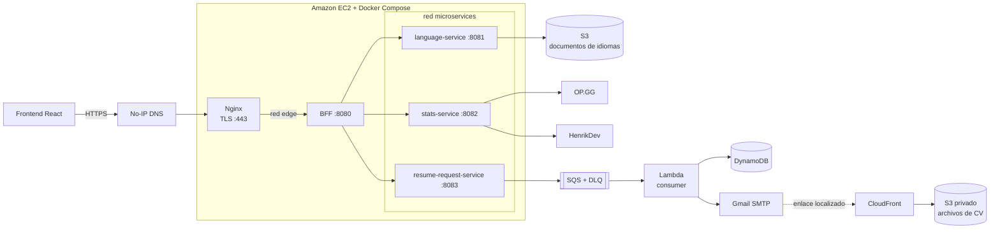

# Portfolio Backend (BFF)

[English](README.md) | **Español**

<p align="center">
  
  
  
  
  
</p>

Backend for Frontend del portafolio personal. Este servicio ofrece al navegador una sola API HTTP, delega cada operación al microservicio privado correspondiente, normaliza las respuestas JSON y aplica controles básicos por visitante antes de permitir el acceso.

> API pública: `https://api-portfolio.zapto.org/api`

## Papel dentro del sistema

El BFF es la única aplicación Java a la que Nginx reenvía tráfico público. Los microservicios no publican puertos en el host y solo son accesibles mediante la red privada `microservices` de Docker Compose.



Un request normal sigue este recorrido:

1. El frontend llama a `https://api-portfolio.zapto.org/api` y agrega las cabeceras de visitante.
2. Nginx termina TLS y reenvía la solicitud al BFF por la red `edge`.
3. El BFF valida las cabeceras y consulta el limitador de solicitudes en memoria.
4. Un controlador MVC delega mediante `RestClient` al servicio de idiomas, estadísticas o solicitudes de CV.
5. El resultado vuelve al cliente dentro del contrato uniforme `{ statusCode, message, data }`.

Aunque el proyecto incluye `spring-cloud-starter-gateway-server-webmvc`, el enrutamiento actual no utiliza rutas declarativas de Spring Cloud Gateway: está implementado explícitamente con controladores, servicios y clientes `RestClient`.

## Ecosistema de repositorios

| Repositorio | Responsabilidad |
| --- | --- |
| [`portfolio-frontend`](https://github.com/JuanSlaterT/portfolio-frontend) | SPA en React 18, TypeScript, Vite, Tailwind e i18next. Consume este BFF, carga desde la API todos los idiomas, muestra las estadísticas y envía solicitudes de CV. |
| [`portfolio-backend`](https://github.com/JuanSlaterT/portfolio-backend) | Este repositorio: BFF, contrato público, CORS, cabeceras de visitante, rate limiting y composición de respuestas. |
| [`portfolio-microservices-language_service`](https://github.com/JuanSlaterT/portfolio-microservices-language_service) | Microservicio Java que lista y descarga desde S3 los documentos JSON de traducción. |
| [`portfolio-microservices-stats_service`](https://github.com/JuanSlaterT/portfolio-microservices-stats_service) | Microservicio Java que consulta OP.GG y HenrikDev y agrega estadísticas de League of Legends y VALORANT. |
| [`portfolio-microservices-resume_request_service`](https://github.com/JuanSlaterT/portfolio-microservices-resume_request_service) | Productor Java que valida la solicitud, genera un UUID v7 y publica el mensaje en SQS. |
| [`portfolio-consumer-resume_request`](https://github.com/JuanSlaterT/portfolio-consumer-resume_request) | Lambda Node.js que persiste en DynamoDB, notifica al administrador y envía al visitante el enlace localizado del CV mediante Gmail SMTP. |
| [`portfolio-arch-terraform`](https://github.com/JuanSlaterT/portfolio-arch-terraform) | Infraestructura AWS, Docker Compose, Nginx/Certbot, S3, CloudFront, SQS, Lambda, DynamoDB, CloudWatch, IAM, SSM y despliegues con GitHub OIDC. |

## Responsabilidades del BFF

Este servicio se encarga de:

- presentar una única superficie HTTP bajo `/api`;
- ocultar las direcciones internas de los microservicios;
- delegar las solicitudes sin acoplar el frontend a la topología de Docker;
- envolver las respuestas JSON en un contrato común;
- propagar el estado y adaptar el cuerpo de los errores HTTP devueltos por los servicios internos;
- exigir metadatos de visitante en cada solicitud que no sea un preflight CORS;
- limitar por `x-visitorId` la frecuencia de solicitudes;
- permitir el frontend local mediante CORS.

El BFF no administra los documentos de idiomas, no consulta directamente los proveedores de videojuegos, no publica mensajes en SQS, no persiste datos y no envía correos. Tampoco es responsable de DNS, TLS, AWS o del despliegue de los contenedores.

## API HTTP

### Endpoints

| Método | Ruta pública | Destino interno | Resultado |
| --- | --- | --- | --- |
| `GET` | `/api/languages` | `language-service:8081` | Catálogo ordenado de idiomas disponibles en S3. |
| `GET` | `/api/languages/{language}` | `language-service:8081` | Documento JSON del idioma solicitado. La coincidencia interna ignora mayúsculas, espacios externos y acentos. |
| `GET` | `/api/stats` | `stats-service:8082` | Vista agregada de League of Legends y VALORANT para el perfil configurado por ese servicio. |
| `POST` | `/api/resume-request` | `resume-request-service:8083` | Acepta una solicitud de CV y activa el flujo asíncrono SQS → Lambda. |

Las variantes con barra final también están aceptadas en los endpoints raíz.

### Cabeceras obligatorias

Todas las solicitudes, excepto `OPTIONS`, deben incluir:

| Cabecera | Contrato validado por el BFF |
| --- | --- |
| `x-visitorId` | UUID versión 4 con variante RFC 4122. Es la clave utilizada por el rate limiter. |
| `x-ipHash` | Texto no vacío. El BFF lo trata como un identificador opaco y no valida aquí su algoritmo. |
| `x-userAgent` | Texto no vacío con información del cliente. |
| `x-lastSeenAt` | Instante ISO-8601 o timestamp Unix en segundos o milisegundos. |

El frontend genera y conserva estos datos en `localStorage`, actualiza `x-lastSeenAt` en cada llamada y agrega las cuatro cabeceras automáticamente.

Ejemplo de consulta local:

```bash
curl -i http://localhost:8080/api/languages \
  -H "x-visitorId: 3d594650-3436-4f38-8d58-e91f0e1c43ed" \
  -H "x-ipHash: e3b0c44298fc1c149afbf4c8996fb92427ae41e4649b934ca495991b7852b855" \
  -H "x-userAgent: local-curl" \
  -H "x-lastSeenAt: 2026-08-31T12:00:00Z"
```

### Solicitud de CV

El body que el frontend envía al BFF es:

```json
{
  "email": "person@example.com",
  "ipHash": "e3b0c44298fc1c149afbf4c8996fb92427ae41e4649b934ca495991b7852b855",
  "language": "es",
  "subscribeToUpdates": true
}
```

`language` debe ser `es` o `en`, que son los idiomas para los cuales el consumidor posee plantillas y archivos de CV. El microservicio productor añade `requestId`, `requestedAt` y `timestamp` antes de publicar el mensaje.

```bash
curl -i -X POST http://localhost:8080/api/resume-request \
  -H "Content-Type: application/json" \
  -H "x-visitorId: 3d594650-3436-4f38-8d58-e91f0e1c43ed" \
  -H "x-ipHash: e3b0c44298fc1c149afbf4c8996fb92427ae41e4649b934ca495991b7852b855" \
  -H "x-userAgent: local-curl" \
  -H "x-lastSeenAt: 1788177600000" \
  -d '{"email":"person@example.com","ipHash":"e3b0c44298fc1c149afbf4c8996fb92427ae41e4649b934ca495991b7852b855","language":"es","subscribeToUpdates":true}'
```

### Contrato de respuesta

Las respuestas JSON exitosas y los errores manejados utilizan:

```json
{
  "statusCode": 200,
  "message": "OK",
  "data": {}
}
```

Ejemplo del catálogo de idiomas:

```json
{
  "statusCode": 200,
  "message": "OK",
  "data": {
    "count": 2,
    "languages": ["English", "Español"]
  }
}
```

Ejemplo de aceptación de una solicitud de CV:

```json
{
  "statusCode": 200,
  "message": "OK",
  "data": {
    "result": "success",
    "message": "Solicitud enviada exitosamente"
  }
}
```

Antes de envolver cualquier respuesta JSON, el advice global elimina recursivamente los campos `trace`, `status` y `error`. Los errores HTTP emitidos por un microservicio conservan su código de estado y se adaptan al contrato público del BFF.

## Rate limiting por visitante

`VisitorRateLimiter` utiliza una ventana móvil en memoria:

| Parámetro | Valor actual |
| --- | ---: |
| Solicitudes permitidas | 10 |
| Ventana | 1 minuto |
| Solicitud que activa el bloqueo | La número 11 dentro de la ventana |
| Duración del bloqueo | 5 minutos |
| Identificador | `x-visitorId` |

Durante el bloqueo, el BFF responde con `429 Too Many Requests` y añade:

```http
x-missingTime: 2026-08-31T12:05:00Z
```

El BFF expone esa cabecera mediante CORS; el frontend conserva el instante en `localStorage` y muestra una cuenta regresiva global hasta que el bloqueo vence.

Este limitador es local al proceso: se reinicia al recrear el contenedor y no comparte estado entre réplicas. Está pensado como protección ligera del portafolio, no como un límite distribuido ni como autenticación.

## Configuración

| Variable de entorno | Predeterminado | Uso |
| --- | --- | --- |
| `PORT` | `8080` | Puerto HTTP del BFF. |
| `LANGUAGE_SERVICE_URL` | `http://localhost:8081` | URL base de `language-service`. |
| `STATS_SERVICE_URL` | `http://localhost:8082` | URL base de `stats-service`. |
| `RESUME_REQUEST_SERVICE_URL` | `http://localhost:8083` | URL base de `resume-request-service`. |

En Docker Compose de producción, los valores esperados son:

```dotenv
LANGUAGE_SERVICE_URL=http://language-service:8081
STATS_SERVICE_URL=http://stats-service:8082
RESUME_REQUEST_SERVICE_URL=http://resume-request-service:8083
```

### CORS

La configuración actual permite:

- origen: `http://localhost:5173`;
- métodos: `GET`, `POST` y `OPTIONS`;
- cualquier cabecera de solicitud;
- lectura desde el navegador de `x-missingTime`.

Antes de servir el frontend desde otro dominio se debe añadir explícitamente ese origen a `CorsConfig` o externalizar la configuración.

## Desarrollo local

### Requisitos

- JDK 21;
- los tres microservicios en `8081`, `8082` y `8083` para probar el flujo completo;
- credenciales y configuración propias de cada integración externa cuando se ejecuten esos microservicios.

Los servicios relacionados necesitan, como mínimo:

| Servicio | Configuración externa principal |
| --- | --- |
| `language-service` | `S3_BUCKET_NAME`, región y credenciales AWS con acceso de lectura a S3. |
| `stats-service` | `SERVICES_OPGG_URL`, `SERVICES_HENRIKDEV_URL` y `HENRIKDEV_API_KEY`. |
| `resume-request-service` | `RESUME_REQUESTS_QUEUE_URL`, región y credenciales AWS con `sqs:SendMessage`. |

Las pruebas unitarias de este repositorio no requieren levantar esos servicios.

### Ejecutar con Maven Wrapper

Windows:

```powershell
.\mvnw.cmd spring-boot:run
```

Linux o macOS:

```bash
./mvnw spring-boot:run
```

> Nota para Windows: el `mvnw.cmd` 3.3.4 incluido actualmente puede fallar en algunos entornos de PowerShell con `No se puede indizar en una matriz nula` y `Cannot start maven from wrapper`. Mientras se regenera el wrapper, se puede usar Maven 3.9.16 instalado (`mvn spring-boot:run`, `mvn test`) o invocar directamente la distribución que el wrapper haya descargado en `.m2/wrapper/dists`.

Con URLs personalizadas en PowerShell:

```powershell
$env:LANGUAGE_SERVICE_URL = "http://localhost:8081"
$env:STATS_SERVICE_URL = "http://localhost:8082"
$env:RESUME_REQUEST_SERVICE_URL = "http://localhost:8083"
$env:PORT = "8080"

.\mvnw.cmd spring-boot:run
```

### Pruebas y empaquetado

```powershell
.\mvnw.cmd test
.\mvnw.cmd clean package
```

```bash
./mvnw test
./mvnw clean package
```

La suite cubre el arranque del contexto, validación de cabeceras, preflight CORS, timestamps ISO/Unix, límite de solicitudes, expiración del bloqueo y la cabecera `x-missingTime`.

## Docker

La imagen usa un build multi-stage con Maven y Eclipse Temurin 21:

```bash
docker build -t portfolio-backend:local .
```

Si los microservicios se ejecutan en el host mediante Docker Desktop:

```bash
docker run --rm -p 8080:8080 \
  -e LANGUAGE_SERVICE_URL=http://host.docker.internal:8081 \
  -e STATS_SERVICE_URL=http://host.docker.internal:8082 \
  -e RESUME_REQUEST_SERVICE_URL=http://host.docker.internal:8083 \
  portfolio-backend:local
```

En Linux puede ser necesario agregar `--add-host=host.docker.internal:host-gateway`. En el despliegue real no se usa esa dirección: los contenedores se descubren mediante DNS de Docker.

El `Dockerfile` ejecuta el empaquetado con `-DskipTests`; por ello, la suite debe ejecutarse como un paso separado antes de construir o publicar la imagen.

## Estructura del repositorio

```text
.
├── Dockerfile
├── pom.xml
├── mvnw / mvnw.cmd
└── src
    ├── main
    │   ├── java/com/juandiego/backend
    │   │   ├── clients/       # RestClient para los tres microservicios
    │   │   ├── config/        # CORS y registro del interceptor
    │   │   ├── controllers/   # Superficie HTTP pública
    │   │   ├── exceptions/    # Excepciones del BFF
    │   │   ├── handlers/      # Respuestas, errores y cabeceras de visitante
    │   │   ├── responses/     # Contrato ApiResponse
    │   │   ├── services/      # Delegación de cada capacidad
    │   │   └── utils/         # Utilidades compartidas
    │   └── resources/application.properties
    └── test/java/com/juandiego/backend
        ├── handlers/          # Validación e interceptor
        └── services/          # Ventana móvil y bloqueo
```

## Despliegue en AWS

La infraestructura se define en [`portfolio-arch-terraform`](https://github.com/JuanSlaterT/portfolio-arch-terraform). El contrato de producción actual es:

- una instancia Amazon Linux 2023 en una subred pública;
- Security Group con entrada pública únicamente en `80` y `443`;
- Nginx como único contenedor con puertos publicados;
- TLS de Let's Encrypt administrado por Certbot;
- BFF conectado a las redes `edge` y `microservices`;
- microservicios conectados únicamente a `microservices`;
- logs de contenedores enviados a `/portfolio/production/backend` en CloudWatch Logs;
- administración de la instancia mediante AWS Systems Manager, sin puerto SSH público;
- despliegues por servicio usando GitHub OIDC, documentos SSM e imágenes identificadas por digest;
- credenciales temporales del rol de EC2 para los servicios que acceden a S3 y SQS, con acceso a IMDS filtrado por el firewall del host.

La imagen se selecciona con:

```text
${dockerhub_username}/portfolio-backend:${bff_version}
```

El contenedor no publica `8080` en el host; Nginx lo alcanza mediante `http://bff:8080` dentro de la red `edge`.

## Consideraciones actuales

- Las cabeceras de visitante y el rate limiter no sustituyen autenticación ni autorización.
- `x-ipHash` y `x-userAgent` solo se comprueban como valores no vacíos en esta capa.
- El rate limiter vive en memoria, no es distribuido y pierde su estado al reiniciar.
- CORS solo permite actualmente el frontend local en `http://localhost:5173`.
- El BFF no aplica reintentos, circuit breaker, caché ni fallback sobre las llamadas internas.
- No hay un endpoint Actuator o health check propio en este repositorio.
- Los contratos de dominio se transportan como `JsonNode`; la validación detallada pertenece a cada microservicio.
- La disponibilidad de `/api/stats` depende simultáneamente de OP.GG y HenrikDev; el servicio de estadísticas no devuelve resultados parciales.
- La entrega de CV es asíncrona. Una respuesta exitosa confirma que el productor publicó en SQS, no que DynamoDB y los correos ya hayan terminado.
- La arquitectura de ejecución usa una sola EC2 y una sola instancia de cada contenedor, por lo que no ofrece alta disponibilidad.

## Autor

**Juan Diego Arévalo Bernal**  
[GitHub](https://github.com/JuanSlaterT) · [LinkedIn](https://www.linkedin.com/in/juan-diego-ar%C3%A9valo-bernal-219428227/)
