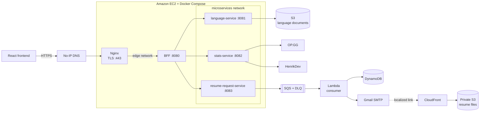

# Portfolio Backend (BFF)

**English** | [Español](README.es.md)

<p align="center">
  
  
  
  
  
</p>

Backend for Frontend for the personal portfolio. This service gives the browser a single HTTP API, delegates each operation to the appropriate private microservice, normalizes JSON responses, and applies basic per-visitor controls before granting access.

> Public API: `https://api-portfolio.zapto.org/api`

## Role in the system

The BFF is the only Java application to which Nginx forwards public traffic. The microservices do not publish host ports and can only be reached through the private Docker Compose `microservices` network.



A normal request follows this path:

1. The frontend calls `https://api-portfolio.zapto.org/api` and adds the visitor headers.
2. Nginx terminates TLS and forwards the request to the BFF over the `edge` network.
3. The BFF validates the headers and checks the in-memory request limiter.
4. An MVC controller delegates through `RestClient` to the language, statistics, or resume-request service.
5. The result is returned to the client in the uniform `{ statusCode, message, data }` envelope.

Although the project includes `spring-cloud-starter-gateway-server-webmvc`, the current routing does not use declarative Spring Cloud Gateway routes. It is implemented explicitly through controllers, services, and `RestClient` clients.

## Repository ecosystem

| Repository | Responsibility |
| --- | --- |
| [`portfolio-frontend`](https://github.com/JuanSlaterT/portfolio-frontend) | React 18, TypeScript, Vite, Tailwind, and i18next SPA. It consumes this BFF, loads every language from the API, displays statistics, and submits resume requests. |
| [`portfolio-backend`](https://github.com/JuanSlaterT/portfolio-backend) | This repository: public BFF contract, CORS, visitor headers, rate limiting, and response composition. |
| [`portfolio-microservices-language_service`](https://github.com/JuanSlaterT/portfolio-microservices-language_service) | Java microservice that lists and downloads translation JSON documents from S3. |
| [`portfolio-microservices-stats_service`](https://github.com/JuanSlaterT/portfolio-microservices-stats_service) | Java microservice that queries OP.GG and HenrikDev and aggregates League of Legends and VALORANT statistics. |
| [`portfolio-microservices-resume_request_service`](https://github.com/JuanSlaterT/portfolio-microservices-resume_request_service) | Java producer that validates the request, generates a UUID v7, and publishes the message to SQS. |
| [`portfolio-consumer-resume_request`](https://github.com/JuanSlaterT/portfolio-consumer-resume_request) | Node.js Lambda that persists the request in DynamoDB, notifies the administrator, and emails the visitor a localized resume link through Gmail SMTP. |
| [`portfolio-arch-terraform`](https://github.com/JuanSlaterT/portfolio-arch-terraform) | AWS infrastructure, Docker Compose, Nginx/Certbot, S3, CloudFront, SQS, Lambda, DynamoDB, CloudWatch, IAM, SSM, and deployments through GitHub OIDC. |

## BFF responsibilities

This service is responsible for:

- presenting a single HTTP surface under `/api`;
- hiding the internal microservice addresses;
- delegating requests without coupling the frontend to the Docker topology;
- wrapping JSON responses in a shared envelope;
- propagating the status and adapting the body of HTTP errors returned by internal services;
- requiring visitor metadata on every request other than a CORS preflight;
- limiting request frequency by `x-visitorId`;
- allowing the local frontend through CORS.

The BFF does not manage language documents, query gaming providers directly, publish SQS messages, persist data, or send email. It also does not own DNS, TLS, AWS resources, or container deployment.

## HTTP API

### Endpoints

| Method | Public path | Internal destination | Result |
| --- | --- | --- | --- |
| `GET` | `/api/languages` | `language-service:8081` | Sorted catalog of the languages available in S3. |
| `GET` | `/api/languages/{language}` | `language-service:8081` | JSON document for the requested language. Internal matching ignores case, surrounding whitespace, and accents. |
| `GET` | `/api/stats` | `stats-service:8082` | Aggregated League of Legends and VALORANT view for the profile configured by that service. |
| `POST` | `/api/resume-request` | `resume-request-service:8083` | Accepts a resume request and starts the asynchronous SQS → Lambda flow. |

The root endpoints also accept their trailing-slash variants.

### Required headers

Every request except `OPTIONS` must include:

| Header | Contract validated by the BFF |
| --- | --- |
| `x-visitorId` | Version 4 UUID with the RFC 4122 variant. This is the rate-limiter key. |
| `x-ipHash` | Non-empty text. The BFF treats it as an opaque identifier and does not validate its algorithm here. |
| `x-userAgent` | Non-empty client information. |
| `x-lastSeenAt` | ISO-8601 instant or Unix timestamp in seconds or milliseconds. |

The frontend creates and stores this information in `localStorage`, updates `x-lastSeenAt` on each call, and automatically adds all four headers.

Example local request:

```bash
curl -i http://localhost:8080/api/languages \
  -H "x-visitorId: 3d594650-3436-4f38-8d58-e91f0e1c43ed" \
  -H "x-ipHash: e3b0c44298fc1c149afbf4c8996fb92427ae41e4649b934ca495991b7852b855" \
  -H "x-userAgent: local-curl" \
  -H "x-lastSeenAt: 2026-08-31T12:00:00Z"
```

### Resume request

The frontend sends this body to the BFF:

```json
{
  "email": "person@example.com",
  "ipHash": "e3b0c44298fc1c149afbf4c8996fb92427ae41e4649b934ca495991b7852b855",
  "language": "en",
  "subscribeToUpdates": true
}
```

`language` must be `es` or `en`, the languages for which the consumer has templates and resume files. The producer microservice adds `requestId`, `requestedAt`, and `timestamp` before publishing the message.

```bash
curl -i -X POST http://localhost:8080/api/resume-request \
  -H "Content-Type: application/json" \
  -H "x-visitorId: 3d594650-3436-4f38-8d58-e91f0e1c43ed" \
  -H "x-ipHash: e3b0c44298fc1c149afbf4c8996fb92427ae41e4649b934ca495991b7852b855" \
  -H "x-userAgent: local-curl" \
  -H "x-lastSeenAt: 1788177600000" \
  -d '{"email":"person@example.com","ipHash":"e3b0c44298fc1c149afbf4c8996fb92427ae41e4649b934ca495991b7852b855","language":"en","subscribeToUpdates":true}'
```

### Response contract

Successful JSON responses and handled errors use:

```json
{
  "statusCode": 200,
  "message": "OK",
  "data": {}
}
```

Language catalog example:

```json
{
  "statusCode": 200,
  "message": "OK",
  "data": {
    "count": 2,
    "languages": ["English", "Español"]
  }
}
```

Accepted resume request example:

```json
{
  "statusCode": 200,
  "message": "OK",
  "data": {
    "result": "success",
    "message": "Solicitud enviada exitosamente"
  }
}
```

Before wrapping any JSON response, the global advice recursively removes the `trace`, `status`, and `error` fields. HTTP errors emitted by a microservice keep their status code and are adapted to the BFF's public contract.

## Per-visitor rate limiting

`VisitorRateLimiter` uses an in-memory sliding window:

| Setting | Current value |
| --- | ---: |
| Allowed requests | 10 |
| Window | 1 minute |
| Request that triggers the block | The 11th request within the window |
| Block duration | 5 minutes |
| Identifier | `x-visitorId` |

While blocked, the BFF returns `429 Too Many Requests` and adds:

```http
x-missingTime: 2026-08-31T12:05:00Z
```

The BFF exposes this header through CORS. The frontend stores the timestamp in `localStorage` and displays a global countdown until the block expires.

This limiter is local to the process: it resets when the container is recreated and does not share state between replicas. It is lightweight portfolio protection, not a distributed limit or an authentication mechanism.

## Configuration

| Environment variable | Default | Purpose |
| --- | --- | --- |
| `PORT` | `8080` | BFF HTTP port. |
| `LANGUAGE_SERVICE_URL` | `http://localhost:8081` | `language-service` base URL. |
| `STATS_SERVICE_URL` | `http://localhost:8082` | `stats-service` base URL. |
| `RESUME_REQUEST_SERVICE_URL` | `http://localhost:8083` | `resume-request-service` base URL. |

The expected values in the production Docker Compose stack are:

```dotenv
LANGUAGE_SERVICE_URL=http://language-service:8081
STATS_SERVICE_URL=http://stats-service:8082
RESUME_REQUEST_SERVICE_URL=http://resume-request-service:8083
```

### CORS

The current configuration allows:

- origin: `http://localhost:5173`;
- methods: `GET`, `POST`, and `OPTIONS`;
- any request header;
- browser access to `x-missingTime`.

Before serving the frontend from another domain, that origin must be explicitly added to `CorsConfig` or the configuration must be externalized.

## Local development

### Requirements

- JDK 21;
- all three microservices on `8081`, `8082`, and `8083` to test the complete flow;
- credentials and configuration for each external integration when those microservices are running.

At a minimum, the related services need:

| Service | Main external configuration |
| --- | --- |
| `language-service` | `S3_BUCKET_NAME`, region, and AWS credentials with read access to S3. |
| `stats-service` | `SERVICES_OPGG_URL`, `SERVICES_HENRIKDEV_URL`, and `HENRIKDEV_API_KEY`. |
| `resume-request-service` | `RESUME_REQUESTS_QUEUE_URL`, region, and AWS credentials with `sqs:SendMessage`. |

This repository's unit tests do not require those services to be running.

### Run with the Maven Wrapper

Windows:

```powershell
.\mvnw.cmd spring-boot:run
```

Linux or macOS:

```bash
./mvnw spring-boot:run
```

> Windows note: the included `mvnw.cmd` 3.3.4 can fail in some PowerShell environments with `Cannot index into a null array` and `Cannot start maven from wrapper`. Until the wrapper is regenerated, use an installed Maven 3.9.16 distribution (`mvn spring-boot:run`, `mvn test`) or invoke the distribution previously downloaded under `.m2/wrapper/dists`.

With custom URLs in PowerShell:

```powershell
$env:LANGUAGE_SERVICE_URL = "http://localhost:8081"
$env:STATS_SERVICE_URL = "http://localhost:8082"
$env:RESUME_REQUEST_SERVICE_URL = "http://localhost:8083"
$env:PORT = "8080"

.\mvnw.cmd spring-boot:run
```

### Tests and packaging

```powershell
.\mvnw.cmd test
.\mvnw.cmd clean package
```

```bash
./mvnw test
./mvnw clean package
```

The suite covers application-context startup, header validation, CORS preflight, ISO/Unix timestamps, the request limit, block expiration, and the `x-missingTime` header.

## Docker

The image uses a multi-stage build with Maven and Eclipse Temurin 21:

```bash
docker build -t portfolio-backend:local .
```

If the microservices are running on the Docker Desktop host:

```bash
docker run --rm -p 8080:8080 \
  -e LANGUAGE_SERVICE_URL=http://host.docker.internal:8081 \
  -e STATS_SERVICE_URL=http://host.docker.internal:8082 \
  -e RESUME_REQUEST_SERVICE_URL=http://host.docker.internal:8083 \
  portfolio-backend:local
```

On Linux, `--add-host=host.docker.internal:host-gateway` may be required. The production deployment does not use this address; containers discover one another through Docker DNS.

The `Dockerfile` packages with `-DskipTests`, so the test suite must run separately before building or publishing the image.

## Repository structure

```text
.
├── Dockerfile
├── pom.xml
├── mvnw / mvnw.cmd
└── src
    ├── main
    │   ├── java/com/juandiego/backend
    │   │   ├── clients/       # RestClient clients for the three microservices
    │   │   ├── config/        # CORS and interceptor registration
    │   │   ├── controllers/   # Public HTTP surface
    │   │   ├── exceptions/    # BFF exceptions
    │   │   ├── handlers/      # Responses, errors, and visitor headers
    │   │   ├── responses/     # ApiResponse contract
    │   │   ├── services/      # Capability delegation
    │   │   └── utils/         # Shared utilities
    │   └── resources/application.properties
    └── test/java/com/juandiego/backend
        ├── handlers/          # Validation and interceptor tests
        └── services/          # Sliding-window and block tests
```

## AWS deployment

The infrastructure is defined in [`portfolio-arch-terraform`](https://github.com/JuanSlaterT/portfolio-arch-terraform). The current production contract is:

- one Amazon Linux 2023 instance in a public subnet;
- a Security Group with public ingress only on `80` and `443`;
- Nginx as the only container with published ports;
- Let's Encrypt TLS managed by Certbot;
- the BFF connected to both `edge` and `microservices` networks;
- microservices connected only to `microservices`;
- container logs sent to `/portfolio/production/backend` in CloudWatch Logs;
- instance administration through AWS Systems Manager without a public SSH port;
- per-service deployments through GitHub OIDC, SSM documents, and digest-addressed images;
- temporary EC2-role credentials for services accessing S3 and SQS, with IMDS access filtered by the host firewall.

The image is selected with:

```text
${dockerhub_username}/portfolio-backend:${bff_version}
```

The container does not publish `8080` on the host. Nginx reaches it through `http://bff:8080` on the `edge` network.

## Current considerations

- Visitor headers and rate limiting do not replace authentication or authorization.
- `x-ipHash` and `x-userAgent` are only checked for non-empty values at this layer.
- The rate limiter is in memory, is not distributed, and loses state on restart.
- CORS currently allows only the local frontend at `http://localhost:5173`.
- The BFF does not apply retries, a circuit breaker, caching, or fallback to internal calls.
- This repository does not expose an Actuator endpoint or its own health check.
- Domain contracts are transported as `JsonNode`; detailed validation belongs to each microservice.
- `/api/stats` depends on both OP.GG and HenrikDev; the statistics service does not return partial results.
- Resume delivery is asynchronous. A successful response confirms that the producer published to SQS, not that DynamoDB persistence and email delivery have completed.
- The runtime architecture uses one EC2 instance and one instance of each container, so it does not provide high availability.

## Author

**Juan Diego Arévalo Bernal**  
[GitHub](https://github.com/JuanSlaterT) · [LinkedIn](https://www.linkedin.com/in/juan-diego-ar%C3%A9valo-bernal-219428227/)
